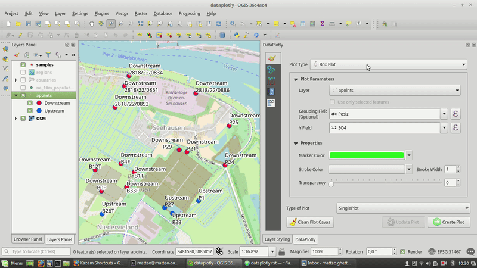
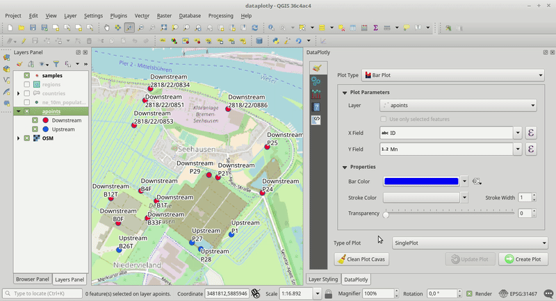

.. meta::
   :description: Free and Open Source GIS development: QGIS, PostGIS, GDAL, MapServer, GRASS
   :keywords: Open Source, Free Software, Software libero, GIS, SIG, QGIS, Quantum GIS, GRASS, SAGA, OTB, PostGIS, PostgreSQL, OsGeo, OGC, python, plugin, C++, sviluppo, programmazione, development, développement, desarrollo, risoluzione problemi, bug fixing

.. toctree::
    :hidden:

    LRS <lrs>
    AniMove <animove>

.. |it| image:: images/italy.png
.. |pt| image:: images/portugal.png

Sviluppo
-------------------------------------------------------------------------------

Faunalia fornisce:

* Sviluppo di plugin per QGIS_ (*core*: GDALTools, DB Manager; *custom*: `lista dei plugins sviluppati <https://plugins.qgis.org/search/?q=faunalia>`_)
* Sviluppo di funzioni *core* per QGIS_, PostGIS_, GRASS_, MapServer_, `GDAL/OGR <http://www.gdal.org/>`_
* Riparazione dei malfunzionamenti per QGIS_, PostGIS_, GRASS_, MapServer_, `GDAL/OGR <http://www.gdal.org/>`_
* Sviluppo di applicazioni webGIS ad hoc

Garantiamo che tutto il codice sviluppato:

* è pubblicato con licenza libera ed open source
* viene incluso nel codice sorgente ufficiale dei rispettivi progetti

In questo modo sarete certi della sua fruibilità e facilità di manutenzione anche nel futuro.

Faunalia ha sviluppato direttamente, già da molti anni, funzioni per tutti i software sopra elencati e fra i nostri collaboratori annoveriamo molti dei più importanti sviluppatori di questi progetti.

.. image :: images/qgis-logo.png
   :target: QGIS_

.. image :: images/grass-gis-logo-48x48.png
   :target: GRASS_

.. image :: images/gdal-logo-48x48.png
   :target: http://www.gdal.org/

.. image :: images/mapserver-logo.png
   :target: MapServer_

.. image :: images/postgis-logo-48x48.png
   :target: PostGIS_

.. _QGIS: https://www.qgis.org/
.. _PostGIS: https://postgis.net/
.. _GRASS: https://grass.osgeo.org/
.. _MapServer: http://mapserver.org/

Plugin sviluppati da Faunalia
++++++++++++++++++++++++++++++++
Faunalia ha sviluppato molti plugin per QGIS. Se sei un utilizzatore di un plugin
ma hai bisogno di una nuova funzionalità o di altri miglioramenti contattaci
`info@faunalia.eu <info@faunalia.eu>`_.

Di seguito un elenco di plugin sviluppati.

DataPlotly
============
`DataPlotly <https://github.com/ghtmtt/DataPlotly>`_ è un plugin per QGIS 3 che
permette la creazione di grafici interattivi in stile D3.

I grafici sono completamente interattivi ed *interagiscono* con gli elementi della
mappa: cliccando o selezionando un elemento del grafico i relativi elementi della
mappa vengono selezionati.

DataPlotly permette di creare molti tipi di grafici diversi con enorme semplicità:
ogni tipologia di grafico ha moltissime personalizzazioni disponibili che arricchiscono
il grafico in molti modi diversi.

Oltre alla possibilità di creare un grafico singolo si possono sovrapporre grafici
(anche ti tipo diverso) oppure si può decidere di collocare i grafici in una vera
e propria griglia.

DataPlotly utilizza la libreria JavaScript `Plotly <https://plot.ly/>`_ costantemente sviluppata ed aggiornata. Grazie a diverse API, Plotly è utilizzabile anche con altri linguaggi di programmazione (Python, R, NodeJS, ecc.).

Ogni grafico è accompagnato dal codice html *grezzo* che lo compone: in questo modo
l'utente può facilmente inserire il grafico in una cornice html.

Inoltre si possono salvare i grafici come immagini statiche (``png``) o come file
``html``: questi ultimi mantengono l'interattività e sono quindi facilmente interrogabili.

Supporto multilingue
........................
DataPlotly è stato concepito per poter essere tradotto in altre lingue. Sia l'interfaccia
utente che il manuale di utilizzo sono disponibili sul portale di traduzione
`Transifex <https://www.transifex.com/dataplotly/>`_ dove è possibile richiedere la propria lingua e tradurre DataPlotly in pochissimo tempo.

Attualmente il plugin è disponibilie in:

* inglese
* italiano
* olandese
* svedese
* francese

Parlano di DataPlotly
........................
DataPlotly ha riscosso un grande successo fra gli utenti e gli sviluppatori di
QGIS. Al |today| il plugin è stato scaricato circa 2000 download e conta diverse
citazioni in siti e blog:

* https://anitagraser.com/2017/12/06/data-exploration-with-data-plotly-for-qgis3/
* http://millermountain.com/geospatialblog/2017/12/18/qgis-data-plotly/
* https://geosupportsystem.wordpress.com/2017/12/13/diagram-i-qgis-3/
* https://www.youtube.com/watch?v=SxtVAtZ4bjA&feature=youtu.be

Supporto a DataPlotly
........................
Sono molte le funzioni non ancora presenti in DataPlotly. Se sei interessato a
supportare il plugin puoi richiedere l'aggiunta di funzionalità.

Trucchi e consigli
........................
Il plugin supporta nativamente tutte le funzionalità di QGIS (utilizzo di espressioni,
stesse finestre di dialogo per la scelta dei colori, ecc..). Di seguito qualche
trucchetto per sfruttare al meglio DataPlotly.

Creare più grafici in righe e colonne diverse
................................................
Oltre a poter sovrapporre grafici sia dello stesso tipo che diversi, DataPlotly
permette di separare i grafici. Questa opzione è particolarmente utile quando
le unità di misura sono molto diverse e la sovrapposizione non darebbe un risultato
visivamente utile.

RT Omero
==========
Un plugin per creare database complessi di edifici integrando rilevamenti su campo.
Pensato per un uso specifico in Toscana può facilmente essere esteso ad altri
casi d'uso.

A `questo link <https://gitlab.com/faunalia/rt_omero>`_ puoi trovare il codice
del progetto, mentre il manuale d'uso è consultabile a
`questo link <https://gitlab.com/faunalia/rt_omero/blob/master/docs/manuale_uso.pdf>`_.

DockableMirrorMap
==================
It allows to split the screen in two or more panels, that can be panned and zoomed both in sync and independently. In QGIS 3 this has become a native function.

AniMove
==================

Triangulation
==================

RandomHR
==================

EQCAP
==================
EarthQuake Catalogue Analysis Plugin

LWGEOM
========================

PS Tools
==================

PS Time series Viewer
======================

Permaclim
==================

RT Qspider
==================

Transformation Tools
======================

