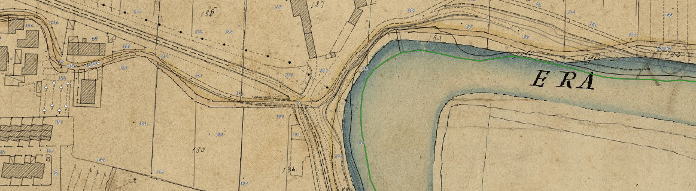

.. meta::
   :description lang=en: Faunalia, Open Source GIS. Leader in solutions based on QGIS: training, development, support
   :description lang=it:  Faunalia, GIS Open Source. Impresa leader nelle soluzioni basate su QGIS: formazione, sviluppo, supporto
   :description lang=fr:  Faunalia, SIG Open Source. Leader dans les solutions basés sur QGIS: formation, développement, assistance
   :keywords: Open Source, Free Software, Software libero, GIS, SIG, QGIS, Quantum GIS, GRASS, SAGA, OTB, PostGIS, PostgreSQL, OsGeo, OGC, supporto, assistenza, risoluzione bugs, migrazione, support, bug fixing, migration, sviluppo, development, corsi, formazione, training courses, développement, assistance, formation

.. toctree::
    :maxdepth: 4
    :hidden:

    Corsi <training>
    Assistenza <support>
    Sviluppo <dev>
    Attività <jobs>
    Chi siamo <intro>
    DataPlotly <dataplotly>
    Error <404>
    Dummy <dummy>

.. cssclass :: topcont

Faunalia
==========================================================================
.. image :: images/logo_faunalia_notext.png

Faunalia
--------------------------------------------------------------------------

Sistemi informativi territoriali liberi ed open source

.. cssclass :: bottomcont

Specialisti di QGIS e Database Geografici PostGIS
============================================================================

QGIS_ e PostGIS_ mettono a disposizione un grande numero di funzionalità per visualizzare, gestire, editare e analizzare dati geografici e per creare stampe con simbologia cartografica avanzata.

QGIS_ e PostGIS_ forniscono un modo semplice ed economico per gestire grandi volumi di dati (ad es. Catasto Urbano, Catasto Rurale, etc.) e per pubblicare servizi standard OpenGeospatialConsortium_ (WMS, WFS, WCS), così come mappe on-line (WebGIS).

I servizi di Faunalia sono presenti nel `catalogo del Mercato Elettronico della Pubblica Amministrazione <https://www.acquistinretepa.it/catricerche/ricercaSemplice.do?cerca=faunalia>`_ (**NB**: è necessario autenticarsi sul sistema). È quindi ora ancora più facile per le Pubbliche Amministrazioni aderire.

`Un esempio di WebGIS di Faunalia: <https://lizmap.faunalia.eu/index.php/view/map/?repository=faunalia&project=pontedera>`_

.. cssclass :: col-md-4  cor

Corsi
===========================================================================

Vuoi imparare, in modo rapido ed efficace, a conoscere e gestire appieno il tuo GIS?

:doc:`More info <training>`

.. cssclass :: col-md-4 ass

Assistenza
============================================================================

Vuoi la certezza e la tranquillità di un supporto costante per la soluzione dei tuoi problemi?

:doc:`More info <support>`

.. cssclass :: col-md-4  svi

Sviluppo
=============================================================================

Hai bisogno di un nuovo comando, di un plugin per velocizzare il tuo lavoro o di correggere un bug?

:doc:`More info <dev>`

.. cssclass :: topcont

Faunalia
==========================================================================

News
--------------------------------------------------------------------------
Nuove funzionalità in QGIS grazie a ARPA Piemonte e Faunalia (5/8)
+++++++++++++++++++++++++++++++++++++++++++++++++++++++++++++++++++++++++++
**Gestione della visibilità di gruppi e legenda nei temi mappa**

Grazie a questa implementazione i temi mappa memorizzano lo stato di apertura/chiusura
dei gruppi e delle legende dei vari layer.

.. raw:: html

    

        <iframe src="https://www.youtube.com/embed/YLYD2wn0p2A" frameborder="0" allowfullscreen style="position: absolute; top: 0; left: 0; width: 100%; height: 100%;"></iframe>
    

Nuove funzionalità in QGIS grazie a ARPA Piemonte e Faunalia (4/8)
+++++++++++++++++++++++++++++++++++++++++++++++++++++++++++++++++++++++++++
**Salvataggio dei progetti in database PostgreSQL**

Enorme novità che permette di salvare uno o più progetti all'interno di un database
PostgreSQL. Con un semplice *dump* del database si potranno quindi condividere
dati, stili e progetti.

.. raw:: html

    

        <iframe src="https://www.youtube.com/embed/l2BvyhEeyaU" frameborder="0" allowfullscreen style="position: absolute; top: 0; left: 0; width: 100%; height: 100%;"></iframe>
    

Nuove funzionalità in QGIS grazie a ARPA Piemonte e Faunalia (3/8)
+++++++++++++++++++++++++++++++++++++++++++++++++++++++++++++++++++++++++++
**Filtro su layer in legenda**

Una grande novità per quanto riguarda la legenda e i layer che hanno un filtro
lato provider. Un nuovo pulsante permette rapidamente di sapere se su un layer
è stato applicato un filtro . Inoltre con un unico click si può aprire la finestra
di dialogo del filtro e cancellarlo o cambiarlo:

.. raw:: html

    

        <iframe src="https://www.youtube.com/embed/19Md_ubALlw" frameborder="0" allowfullscreen style="position: absolute; top: 0; left: 0; width: 100%; height: 100%;"></iframe>
    

Nuove funzionalità in QGIS grazie a ARPA Piemonte e Faunalia (2/8)
+++++++++++++++++++++++++++++++++++++++++++++++++++++++++++++++++++++++++++
**Migrazione plugin PS Time Series Viewer per QGIS 3**

Il plugin PS Time Series Viewer è stato *portato* con successo ed è disponibile in QGIS 3.

Questo plugin permette di elaborare serie temporali di dati interferometrici.

.. image :: images/ps-time.gif

Paolo Cavallini è il nuovo presidente di QGIS.org
+++++++++++++++++++++++++++++++++++++++++++++++++++++++++++++++
Paolo Cavallini è il nuovo presidente di QGIS.org

Dopo tanti anni di continua, attiva e proficua collaborazione Paolo Cavallini
è il nuovo presidente di QGIS.org, la fondazione internazionale che sostiene, organizza e tutela lo sviluppo di QGIS.

Siamo onorati dalla fiducia che la comunità ha accordato, e continueremo a lavorare a questo progetto, pienamente cooperativo e democratico, per il progresso di uno strumento che consente a tutti di lavorare e creare liberamente.

`https://blog.qgis.org/2018/04/13/qgis-annual-general-meeting-2018/ <https://blog.qgis.org/2018/04/13/qgis-annual-general-meeting-2018/>`_

Nuove funzionalità in QGIS grazie a ARPA Piemonte e Faunalia (1/8)
+++++++++++++++++++++++++++++++++++++++++++++++++++++++++++++++++++++++++++
La collaborazione fra Faunalia e ARPA Piemonte all'interno del progetto Erikus permetterà di avere moltissime nuove funzionalità a partire dalla prossima versione (3.2) di QGIS.

**Messaggio su sposta e cancella elementi**

Quante volte è capitato di eliminare o spostare delle geometrie per sbaglio solamente perché queste non sono visibili sulla mappa? Un errore che non capiterà più di fare!

.. image :: images/move-elements.gif

Guide degli algoritmi di Processing in QGIS3
+++++++++++++++++++++++++++++++++++++++++++++++++
Grazie ad una *Grant Proposal* di QGIS.ORG è stato completato il nuovo sistema di Help per gli algoritmi di Processing.

Matteo Ghetta ha scritto le guide tutti i 158 algoritmi di QGIS in Processing. Dalla versione 3.0 è infatti possibile cliccare sul pulsante  ``Help`` di ogni algoritmo di QGIS all'interno di Processing per poter accedere alla guida dell'algoritmo direttamente sulla pagina ufficiale del sito di QGIS.

Le guide degli algoritmi sono aggiornate con gli ultimi sviluppi del codice e moltissime guide sono state arricchite di immagini e descrizioni più approfondite.

Per dare una piccola idea del lavoro svolto:

* `32 *Pull Request* fatte e chiuse <​https://github.com/qgis/QGIS-Documentation/pulls?q=is%3Apr+is%3Aclosed+author%3Aghtmtt+label%3A%22Processing+help%22>`_
* circa 20 files rst modificati
* `migliaia di righe di descrizione aggiunte e modificate <https://github.com/qgis/QGIS-Documentation/commits?author=ghtmtt>`_
* moltissime figure esplicative aggiunte
* `più di 25 *issues* chiuse <https://github.com/qgis/QGIS-Documentation/issues?q=is%3Aissue+is%3Aclosed+label%3AProcessing>`_

Ecco un link per dare un'idea: `QGIS Pendenza <https://docs.qgis.org/3.0/en/docs/user_manual/processing_algs/qgis/rasterterrainanalysis.html#slope>`_

Il sistema di Help è stato costruito in modo da essere aggiornabile per ogni versione di QGIS, è traducibile in tutte le lingue ed è facilmente modificabile da chiunque.

QGIS 3 è stato rilasciato
+++++++++++++++++++++++++++++
Dopo un enorme sforzo di tutta la comunità di QGIS, QGIS 3 è stato finalmente rilasciato: `https://qgis.org/en/site/ <https://qgis.org/en/site/>`_. Il team di Faunalia ha contribuito moltissimo anche a questa versione: test dei nuovi plugin, documentazione di Processing, formazione e disseminazione, sviluppo dei plugin e molto molto altro.

Legenda bivariata per QGIS 3
++++++++++++++++++++++++++++++++++
Interessantissimo plugin per la nuova versione di QGIS 3:
`https://github.com/webgeodatavore/bivariate_legend/ <https://github.com/webgeodatavore/bivariate_legend>`_

Faunalia, ancora una volta al primo posto
++++++++++++++++++++++++++++++++++++++++++++++++++++++++
Faunalia è orgogliosa di annunciare che è la **prima azienda italiana** a poter rilasciare una **certificazione ufficiale**, `riconoscituta internazionalmente di QGIS <http://changelog.qgis.org/en/qgis/certifyingorganisation/qgis-faunalia/>`_.

Chi seguirà un corso potrà quindi richiedere, in aggiunta al certificato Faunalia, anche una certificazione garantita e verificabile di della fondazione internazionale QGIS.ORG.

Il servizio ha un costo addizionale, che contribuisce a finanziare lo sviluppo di QGIS.

DataPlotly plugin per la creazione di grafici stile D3js
++++++++++++++++++++++++++++++++++++++++++++++++++++++++++++

* Raggiunti 2000 download!
    Il plugin DataPlotly permette di creare grafici in stile D3js interattivi in QGIS 3. DataPlotly permette di creare molti grafici diversi, di sovrapporli oppure di seprarli in righe e colonne. Cliccando su un elemento del
    grafico si vedranno le geometrie corrispondenti sulla mappa. Ci sono moltissime personalizzazioni disponibili: colori del grafico, statistiche elaborate e molto molto altro ancora.
    Il plugin è completo di manuale d'uso e attualmente è disponibile in inglese, italiano, olandese, svedese e francese. Guarda il repository ufficiale con molti esempi `DataPlotly <https://github.com/ghtmtt/DataPlotly>`_

    .. image :: images/dataplotly.gif

Parnership con Expédition MED
++++++++++++++++++++++++++++++++++

* Nel quadro del nostro impegno di lungo termine per la conservazione della biodiversità e per la tutela ambientale, Faunalia sostiene la campagna 2017 di `Expédition MED <http://it.expeditionmed.eu/fr/>`_, che percorre il Mediterraneo centrale raccogliendo campioni di microplastiche, per stimare l'impatto che queste hanno sull'ecosistema marino. Faunalia dà consulenza GIS al progetto, e aiuta a diffondere i risultati con la creazione di un `WebGIS dedicato <https://lizmap.faunalia.eu/index.php/view/map/?repository=faunalia&project=tosca0>`_. Guarda un `video della campagna <https://www.youtube.com/watch?v=qF-grPtvtmw>`_ e una `presentazione del progetto <https://www.youtube.com/watch?v=rAq3DU0V57s>`_ (in francese).

QGIS e Faunalia al FOSS4G-IT 2017
++++++++++++++++++++++++++++++++++

* Durante il prossimo `FOSS4G-IT 2017 <http://www.dicca.unige.it/geomatica/foss4git_2017/>`_ terremo un workshop di `Introduzione a QGIS <http://www.dicca.unige.it/geomatica/foss4git_2017/index.html#workshop>`_ e un intervento su `QGIS 3: stato dell'arte e prospettive <http://www.dicca.unige.it/geomatica/foss4git_2017/programma.html>`_. Vi aspettiamo, sarà una buona occasione per scambiare opinioni.

Perché ti conviene scegliere i corsi Faunalia
++++++++++++++++++++++++++++++++++++++++++++++++++++

* Abbiamo realizzato il recente corso di *Analisi con QGIS*, come sempre, usando l'ultima versione, QGIS 2.18 "Las Palmas", pubblicata proprio il giorno prima dell'inizio. Durante la preparazione e la realizzazione del corso abbiamo trovato `20 problemi, tutti debitamente segnalati, di cui 7 sono già sistemati <http://hub.qgis.org/projects/quantum-gis/issues?author_id=10&set_filter=1&status_id=*&subproject_id=!*>`_, ed altri lo saranno presto (grazie Victor!). I partecipanti hanno imparato a confrontarsi con i problemi reali, e risolverli efficacemente. Negli anni, questo lavoro ha consentito di aprire oltre 900 tickets, e di sistemare oltre 670 malfunzionamenti. Investire in Faunalia risulta direttamente in un QGIS migliore. Nessuno dei nostri concorrenti ti offre questo vantaggio.

Advanced QGIS @ OGRS 2016
+++++++++++++++++++++++++++

* At the `Open Source Geospatial Research & Education Symposium 2016 <http://2016.ogrs-community.org>`_, in Perugia, Italy, Paolo Cavallini will present a hands-on workshop on `Advanced QGIS <http://2016.ogrs-community.org/scientific-program/workshops#advanced>`_

Workshop su QGIS_
++++++++++++++++++++

* Il 7 ottobre 2016, all'`ArcheoFOSS 2016 <http://www.archeofoss.org/archeofoss-2016/>`_, presso l'Università di Cagliari, Paolo Cavallini terrà un workshop su *Cartografia con QGIS: dal foglio bianco alle tecniche avanzate*. A presto!

Cluster renderer: a good chance to improve QGIS
+++++++++++++++++++++++++++++++++++++++++++++++++++

* Nyall Dawson, one of the most productive QGIS core developers, has just `launched a campaign <http://north-road.com/qgis-cluster-renderer-crowdfunding/>`_ to implement one of the few missing features in QGIS: the cluster renderer for points. With a small investment you can now be sure you'll have it available soon. See his `crowdfunding page <http://north-road.com/qgis-cluster-renderer-crowdfunding/>`_ for details.

World first: sailing & QGIS
+++++++++++++++++++++++++++

* Love sailing? Come to the first `QGIS course on a cruise! <sail_course.html>`_

Need 3D in QGIS? A glimpse of the future
+++++++++++++++++++++++++++++++++++++++++++

* You can use `Qgis2threejs <https://plugins.qgis.org/plugins/Qgis2threejs/>`_ plugin to easily create `dynamic 3D visualization of your map <https://www.faunalia.eu/it/3d/20160316105926.html>`_, and that's fun enough. Look at what you'll be able to do, even more easily, in the near future, once QGIS has moved to Qt5 - work underway. `Minoru <https://github.com/minorua>`_ rocks!

.. image :: images/next-3d.gif
   :width: 300px

Layer board: configure your big QGIS projects, easily
+++++++++++++++++++++++++++++++++++++++++++++++++++++++

* Configuring large projects, with tens of layers, can be painful if you have to set up min and max scale, CRS, style, title, extent, etc. one by one. `Layer board <https://plugins.qgis.org/plugins/LayerBoard/>`_ plugin makes all this a breeze: you have a spreadsheet where you can enter directly the values for all layer parameters. Moreover, you can clean up your projects by automagically removing ghost layers that sometimes accumulate. Kudos to *Michaël Douchin* from 3liz!

.. image :: images/layer_board.png
   :width: 300px

Another nice plugin: Historical maps
+++++++++++++++++++++++++++++++++++++

* A very simple to use, yet powerful plugin (`Historical Map <https://plugins.qgis.org/plugins/HistoricalMap/>`_) for doing supervised classification of land use. It is especially designed for finding woodlands in historical maps, but I tested with normal ortophoto, with good results.

.. image :: images/hist_map.png
   :width: 300px

Big plans for next QGIS_
++++++++++++++++++++++++++

* Major transitions in large software projects are always a big challenge, and involve considerable risks. After a long gestation, now we have a definite plan towards QGIS 3.0, andt we believe this is the best way forward. `Read about it <https://blog.qgis.org/2016/02/10/qgis-3-0-plans/>`_, straight from the project leader, and join us for the next leap forward.

Workshop su QGIS_
++++++++++++++++++++

* Al `GRASS Meeting 2016 <http://meetingrass2016.unipr.it/>`_, presso l'Università di Parma, Paolo Cavallini terrà un workshop sulle ultime novità di QGIS, fino alla versione 2.14, di imminente pubblicazione. Ci vediamo lì!

Novità in QGIS_
+++++++++++++++++++

* Nuova versione di QGIS "stabile" (*Long Term Release*, LTR): 2.8.4, che sistema oltre 80 malfunzionamenti, inclusi alcuni importanti
* Nuova versione di QGIS "Lyon" (2.12.1), che sistema quasi 70 malfunzionamenti
* `Nuova versione di QField <http://www.opengis.ch/2015/12/01/qfield-for-android-5/>`_, che **finalmente** gira anche su Android 5! La trovate in Google Play

.. image :: images/qfield1.png
   :width: 300px

An easier and safer life for QGIS plugin writer
++++++++++++++++++++++++++++++++++++++++++++++++

* Now, thanks to Martin Dobias, plugin writer can relax a bit more: with the plugin `First Aid <https://plugins.qgis.org/plugins/firstaid/>`_ finding errors and debugging your plugin will be far easier. This will also help you to get ready for the upcoming Python 3 and Qt 5 transition, a major breakthrough.

.. image :: images/firstaidplugin.png
   :width: 48px

Nasce il gruppo italiano degli utenti di QGIS_
++++++++++++++++++++++++++++++++++++++++++++++++++++++

* Siamo finalmente pronti: da oggi chi è interessato al futuro di QGIS potrà partecipare attivamente. Trovate le semplicissime istruzioni sul sito `QGIS.it <https://qgis.it/>`_ . In pratica, ci mettiamo insieme, tutti quelli che donano (codice o euro) al progetto decidono poi insieme come investire quanto raccolto. Per qualunque chiarimento, non esitate a chiedere.

.. image :: images/qgis-icon.png
   :width: 300px

Paolo Cavallini appointed as QGIS co-chair
++++++++++++++++++++++++++++++++++++++++++++

* **QGIS.org** is becoming a formal association. In this process, Tim Sutton has been elected as Chair of the project, and Paolo Cavallini as co-chair - a great honour and responsibility. See the `blog post <https://blog.qgis.org/2015/11/03/introducing-the-qgis-board/>`_.

Yet another country: Faunalia training in Saudi Arabia
++++++++++++++++++++++++++++++++++++++++++++++++++++++++

* Renzo Cavallini has recently done a successful course at the College of Technology in Riyadh (Saudi Arabia) about geotechnical testing.

.. image :: images/arabia1.jpg
   :width: 300px

Faunalia al Linux Day
+++++++++++++++++++++++

* Paolo Cavallini parlerà di geografia libera (QGIS e dati geografici) al `Linux Day di Livorno <http://linux.livorno.it/sito/1080/linux-day-2015/>`_: una chiacchierata informale, venite e chiedete.

.. image :: images/ld_li_2015.png
   :width: 300px

Let us hear your voice: a survey on QGIS usage
+++++++++++++++++++++++++++++++++++++++++++++++++

* We would like to better understand how you are using QGIS so that we can improve the way that we manage the project. We have compiled this short survey, and would be most appreciative if you could take a few minutes to complete it for us. All responses are anonymous and we will share the results with the community so that we can all benefit from the insights gained. You can find the `survey here <https://blog.qgis.org/2015/10/15/take-the-qgis-user-survey/>`_

New PostGIS version
+++++++++++++++++++++

* Just released **PostGIS 2.2.0**: lots of `improvements and new functions <https://svn.osgeo.org/postgis/tags/2.2.0/NEWS>`_. My favourite of the day: `ST_ClusterWithin <https://postgis.net/docs/manual-2.2/ST_ClusterWithin.html>`_, which aggregates all geometries within a set distance from the others.

GFOSS Day Italia 2015: Faunalia c'è
+++++++++++++++++++++++++++++++++++++

* Faunalia sarà presente al `GFOSS Day 2015 <http://gfossday2015.associazionegfoss.it/index.html>`_, la settima conferenza italiana sul software geografico libero ed open source, a Lecco il 28 e 29 settembre, con: (1) un workshop su QGIS_; (2) una conferenza sullo stato di sviluppo del progetto QGIS_; (3) un intervento, già annunciato, nell'ambito della `conferenza ASITA <http://www.asita.it/>`_. Per iscrivervi al workshop, usate la `pagina di registrazione <http://gfossday2015.associazionegfoss.it/registrazione.html>`_. L'iscrizione è gratuita per i soci GFOSS.it, richiede una donazione per i non soci. **A presto!**

QGIS keeps on growing in popularity, ArcGIS starts declining?
+++++++++++++++++++++++++++++++++++++++++++++++++++++++++++++++

* `Long term trends in internet searches <https://www.google.com/trends/explore#q=qgis%2C%20arcgis%2C%20gvsig%2C%20mapinfo&cmpt=q&tz=Etc%2FGMT-2>`_ seem to show a continuous increase in QGIS popularity; what is new is that the proprietary market leader started loosing ground, for the first time ever - future is bright for free GIS.

.. image :: images/trends0.png
   :width: 300px

Really Fast Fourier filter for rasters in QGIS
++++++++++++++++++++++++++++++++++++++++++++++++

* I just approved for publication an interesting plugin: `FFT Convolution Filters <https://plugins.qgis.org/plugins/fft-convolution-filter-master/>`_; it allows both to detect edges and smooth an existing raster - and it's impressively fast! *Beware*: you need NumPy, SciPy and Rasterio python modules installed in your system. Have fun.

.. image :: images/ff_convolution.png
   :width: 300px

Full GRASS 7 support in QGIS
+++++++++++++++++++++++++++++++

* Thanks to the patient work of Radim Blazek, and to the many donors, the work on a full, and much improved, support for GRASS in QGIS is almost completed. See the detail at the `crowdfunding page <http://www.gissula.eu/qgis-grass-plugin-crowdfunding/progress.html>`_. Expected delivery in 1.5 months, with QGIS 2.12.

A WPS inside QGIS?
++++++++++++++++++++

* Thanks to friends from `3Liz <https://www.3liz.com/>`_, you can now have `Web Processing <https://github.com/3liz/qgis-wps4server>`_ within your QGIS server, in addition to the existing WMS and WFS. **wps4server** is a QGIS Server Plugin that provides `OGC Web Processing <http://www.opengeospatial.org/standards/wps>`_ capabilities, based on `PyWPS <http://pywps.wald.intevation.org/>`_ and QGIS Processing. With wps4server you can publish all the QGIS Processing algorithms through Web Processing. This means you can create a Web Processing Service that provides QGIS, GRASS7, GDAL/OGR, Orfeo Toolbox, SAGA algorithms, and also your R and Python scripts algorithms, and your Processing models. With a configuration file, you can restrict the algorithms number. `Source code and an installation guide <https://github.com/3liz/qgis-wps4server>`_ available. *Test and feedback are welcome!*

More background maps in QGIS
+++++++++++++++++++++++++++++++

* One hidden gem in QGIS: `QuickMapServices Plugin <https://plugins.qgis.org/plugins/quick_map_services/>`_; it allows you to add 47 background layers from the web, including the well known Google services as well as less known, interesting stuff - and you are encouraged to add your own!

.. image :: images/quickmapservices.png
   :width: 300px

Paolo Cavallini @ ASITA
+++++++++++++++++++++++++++

* Nella prossima `conferenza ASITA <http://www.asita.it/>`_ (Federazione delle Associazioni Scientifiche per le Informazioni Territoriali e Ambientali) terremo un intervento nella sessione `Il software geografico libero: una reale opportunità di sviluppo? <http://www.asita.it/blog/il-software-geografico-libero-una-reale-opportunita-di-sviluppo/>`_ Siete i benvenuti, passate ed intervenite.

Change the interface of your QGIS
++++++++++++++++++++++++++++++++++++++++

* It is now possible, in the development version of QGIS, to `choose and create your theme <http://nathanw.net/2015/08/29/ui-theme-support-now-core-in-qgis/>`_. If you create something interesting, why not sharing it, so it may go in the next version, due in October?

.. figure:: https://woostuff.files.wordpress.com/2015/08/qgis-b789fab_029.png?w=730
   :width: 300px

Opinions on QGIS: today and the future
++++++++++++++++++++++++++++++++++++++++

* An `interview <https://exporttocanoma.blogspot.it/2015/08/intervista-paolo-cavallini.html>`_ with Paolo Cavallini about QGIS and more. In Italian, sorry, non-latins! :)

Customize your QGIS menus
++++++++++++++++++++++++++++

* The flux of plugins keeps on steady - just published: **Menu builder**: Create your own menus with your favorite layers. Easy configuration is done with drag & drop from the qgis browser. More are in the queue, stay tuned.

.. figure:: https://github.com/Oslandia/qgis-menu-builder/raw/master/preview.png
   :width: 300px

New QGIS Long Term Release
++++++++++++++++++++++++++++++++

* `QGIS 2.8.3 'Wien' new bugfix release is out <https://qgis.org/en/site/forusers/download.html>`_. Hundreds of bugfixes `(see the list <https://github.com/qgis/QGIS/compare/final-2_8_2...final-2_8_3>`_) - upgrade now! `More details on the QGIS blog <https://blog.qgis.org/2015/08/06/point-release-qgis-2-8-3-wien-is-ready/>`_

A new QGIS plugin: Natural earth data
+++++++++++++++++++++++++++++++++++++++

* Just published: `a new plugin <https://plugins.qgis.org/plugins/natural_earth_raster/>`_ to automatically download Natural Earth data. Enjoy, and `report any issue <https://github.com/informeren/qgis-natural-earth-raster/issues>`_

Yet another interesting QGIS plugin: Cartograms
+++++++++++++++++++++++++++++++++++++++++++++++++

* `Create distorted maps <https://plugins.qgis.org/plugins/cartogram/>`_, where areas of each polygon represents a variable in your data. An example:

.. figure:: https://raw.githubusercontent.com/informeren/qgis-cartogram/develop/assets/cartogram.png
   :width: 400px

.. _QGIS: https://www.qgis.org/
.. _PostGIS: http://postgis.net/
.. _OpenGeospatialConsortium: http://www.opengeospatial.org/
