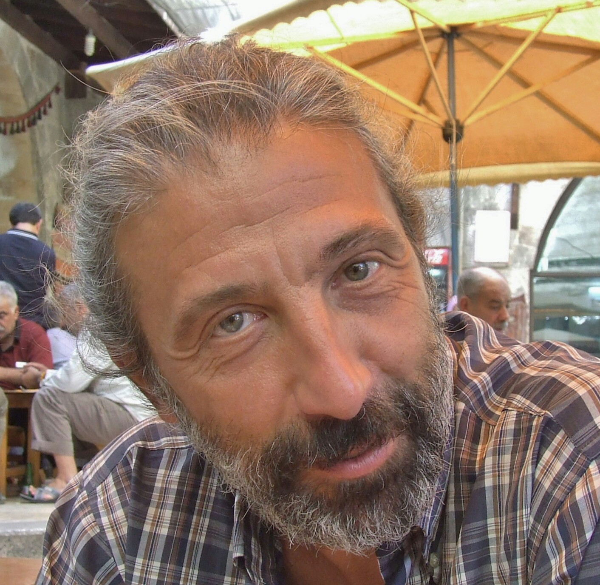
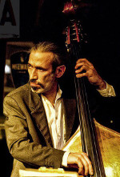
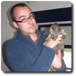
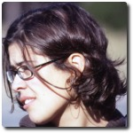

Chi siamo
------------------------------------------------------------

Faunalia è una società che opera da più di 10 anni nell’ambito dei GIS, i sistemi informativi territoriali, con software libero e open source. I nostri clienti sono pubbliche amministrazioni, aziende private, associazioni. Faunalia ha uffici in Italia, a Pontedera (Pisa), e in Portogallo, a Évora, e opera in tutto il mondo.

La nostra visione
++++++++++++++++++++++++++++++++++++++++++++++++++++++++++++

Le nostre attività si basano sulla convinzione che il software libero e open source sia la scelta migliore e più efficace, in particolare in relazione ai GIS.
Utilizzare un GIS open source e libero offre numerosi vantaggi rispetto alle alternative proprietarie presenti sul mercato, sia per il cliente, sia per lo sviluppo sociale complessivo. Consente innanzitutto un controllo pieno e trasparente del software utilizzato e quindi una totale indipendenza del cliente rispetto ai fornitori.
Da un punto di vista tecnico, i GIS open source consentono la massima flessibilità e personalizzazione delle soluzioni sviluppate e un costante aggiornamento del software, garantito dal lavoro di una rete di sviluppatori internazionale. Inoltre, rispetto ai sistemi proprietari, assicurano la massima persistenza dei dati geografici nel tempo e, grazie all’impiego di standard aperti, un’alta interoperabilità tra sistemi informativi.

I software GIS hanno un costo complessivo più basso dei software proprietari e l’assenza di costi di licenza d’uso rimuove una barriera importante all’ingresso che favorisce una adozione maggiore, presso una più ampia varietà di utilizzatori e sempre legale.
Utilizzare GIS open source significa incentivare il lavoro di sviluppatori locali, arricchendo il territorio, incrementando le competenze a livello nazionale, favorendo una maggiore competizione e quindi offrendo maggiori tutele per il cliente rispetto ad offerte di tipo monopolistico.

I nostri valori
++++++++++++++++++++++++++++++++++++++++++++++++++++++++++++
Le attività di Faunalia si basano su valori per noi fondamentali:

* **onestà**: è fondamentale nella relazione con il cliente per il rispetto dei reciproci ruoli e per la costruzione di un rapporto di fiducia e di reciproca soddisfazione
* **centralità del cliente**: le esigenze del cliente sono il criterio guida delle nostre attività, non soltanto per perseguirne la completa soddisfazione, ma per renderlo pienamente in possesso delle soluzioni sviluppate e del know-how per il suo utilizzo, evitando di instaurare una dipendenza dal fornitore
* **qualità**: garantiamo standard di qualità alti, anche mediante il nostro continuo aggiornamento teorico e pratico sui GIS e la collaborazione con i migliori sviluppatori nazionali e internazionali. 

Faunalia è inoltre particolarmente impegnata a diminuire il più possibile l'impatto delle proprie attività sull'ambiente, quindi: riduciamo i nostri spostamenti, privilegiando il lavoro da remoto; utilizziamo, in modo accorto, l’energia elettrica proveniente da fonti rinnovabili certificate; adottiamo cicli di utilizzo dell'hardware più lunghi di quelli standard, e favoriamo il riutilizzo delle singole componenti e il trashware.

I servizi
++++++++++++++++++++++++++++++++++++++++++++++++++++++++++++
La nostra offerta di servizi è riassumibile in tre aree principali: :doc:`sviluppo <dev>`, :doc:`assistenza <dev>` e :doc:`formazione <training>`.

Faunalia lavora direttamente allo sviluppo del software che utilizza e offre sul mercato, collaborando con i migliori sviluppatori GIS a livello internazionale. Negli anni, abbiamo contribuito allo sviluppo di vari strumenti, fra cui QGIS, GRASS, PostGIS, GDAL/OGR. 

Oltre allo sviluppo software, offriamo, a costi competitivi, attività di intervento rapido e di assistenza continuativa su tutte le problematiche relative ai GIS.

Infine teniamo corsi di formazione teorico-pratica, sia standard, sia personalizzati, presso le nostre sedi e presso i nostri clienti.

Team
++++++++++++++++++++++++++++++++++++++++++++++++++++++++++++
L'attività di Faunalia si basa su una fitta rete internazionale di collaboratori. Il *core team* è composto da:

.. |it| image:: images/italy.png
.. |pt| image:: images/portugal.png

Paolo Cavallini |it| |pt|
...............................................................................
.. rst-class:: thumbnail staff-img

* Fondatore di Faunalia
* Membro del *QGIS Project Steering Commitee* col ruolo di *Financial/Marketing Advisor*
* Socio fondatore di ed ex presidente di `GFOSS.it - Italian Geographic Free and Open-Source Software Association <http://www.gfoss.it/drupal/>`_
* Socio e *charter member* della fondazione internazionale `OSGeo - Open Source Geospatial Foundation <http://www.osgeo.org/>`_
* Socio fondatore di `ITPUG - ITalian PostgreSQL User Group <http://www.itpug.org>`_
* Membro di `IUCN - The World Conservation Union - Species Survival Commission <http://www.iucn.org/>`_, ex Presidente dello *IUCN Small Carnivore Specialist Group* e membro dello *IUCN - European Sustainable Use Specialist Group*
* Oltre 10 anni di esperienza sui GIS liberi
* Dottore di ricerca

* :doc:`Curriculum Vitae (html) <cv_pc_it>`
* `Curriculum Vitae (pdf) <pdf/Cavallini_CV_it.pdf>`_ - `europeo (pdf) <pdf/Cavallini_CV_eu.pdf>`_

* *e-mail*: cavallini@faunalia.it - *PEC*: paolo.cavallini@pec.it
* *Tel/Viber/Line*: +39-348-3801953
* *Skype*: paolo.gg.cavallini
* *Hangout*: paolo.cavallini@gmail.com

.. raw:: html

	

Renzo Cavallini |it|
...............................................................................
.. rst-class:: thumbnail staff-img

* Geologo, specializzato in geofisica
* Ha collaborato a livello scientifico e didattico con l'Università di Pisa
* Ha pubblicato nel settore geofisico
* Conduce attività di prospezione geotecnica, in laboratorio ed *in situ*

  * esecuzione ed elaborazione di prove di laboratorio su terreni naturali: consolidazione edometrica, taglio diretto CD, triassiali (UU, CU, CD), compressione semplice, analisi granulometrica, limiti di consistenza (LL, LP, LR), peso specifico dei granuli, permeabilità in cella edometrica, triassiale e in permeametro (norme seguite: racc. AGI, CNR, ASTM)
  * esecuzione ed elaborazione di prove di laboratorio su materiali stradali e da costruzione: compattazione Proctor Standard e modificata, penetrazione CBR, miscelazione delle terre con calce (norme seguite: EN, CNR, ASTM)
  * esecuzione ed elaborazione di prove in situ: penetrometriche statiche con punta meccanica, elettrica e piezocono, penetrometriche dinamiche con o senza rivestimento, PLT, densità in situ
  * installazione e messa a punto di apparecchiature di laboratorio e di sistemi di acquisizione automatica; calibrazione di trasduttori elettrici

* *e-mail*: renzo.cavallini@faunalia.it

Giovanni Manghi |pt|
...............................................................................
.. rst-class:: thumbnail staff-img

* Fondatore di Faunalia Portogallo
* Biologo specializzato in Conservation Biology
* Socio e *charter member* della fondazione internazionale `OSGeo - Open Source Geospatial Foundation <http://www.osgeo.org/>`_
* Socio fondatore di `OSGeo Portugal - Portuguese Geographic Free and Open-Source Software Association <http://osgeopt.pt/>`_
* Membro di `IUCN - The World Conservation Union - *IUCN Small Carnivore Specialist Group* <http://www.iucn.org/>`_
* Oltre 7 anni di esperienza sui GIS liberi

* :doc:`Curriculum Vitae (html) <cv_gm_it>`
* `Curriculum Vitae (pdf) <pdf/Manghi_CV_it.pdf>`_ - `europeo (pdf) <pdf/Manghi_CV_eu.pdf>`_

* *e-mail*: giovanni.manghi@faunalia.pt
* *Tel/Viber/Line*: +351967058216
* *Skype*: toirao
* *Hangout*: giovanni.manghi@gmail.com

Vânia Neves |pt|
...............................................................................
.. rst-class:: thumbnail staff-img

* Fondatrice di Faunalia Portogallo
* Biologa specializzata in Conservation Biology
* Socia fondatrice di `OSGeo Portugal - Portuguese Geographic Free and Open-Source Software Association <http://osgeopt.pt/>`_
* Oltre 7 anni di esperienza sui GIS liberi

* :doc:`Curriculum Vitae (html) <cv_vn_it>`
* `Curriculum Vitae (pdf) <pdf/Neves_CV_it.pdf>`_ - `europeo (pdf) <pdf/Neves_CV_eu.pdf>`_

* *e-mail*: vania.neves@faunalia.pt
* *Tel/Viber/Line*: +351939320104
* *Skype*: vaniavanilla
* *Hangout*: vbneves@gmail.com
