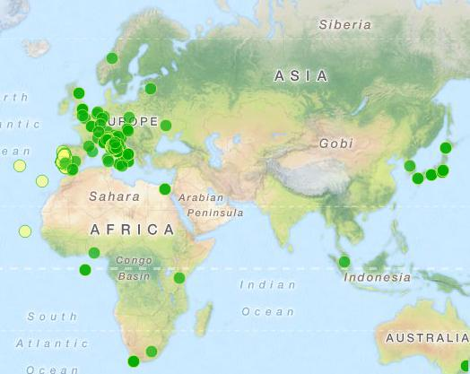

.. meta::
   :description: Faunalia home page
   :keywords: GIS, QGIS, GRASS, OTB, PostGIS, PostgreSQL, WebMapping, MapServer, WebGISfree, Python, C++, SDI, OsGeo, OGC, assistenza, supporto, corsi, formazione, sviluppo, programmazione, risoluzione bugs, support, training, development, bug fixing, Open Source, Free Software, plugin, extensions, Software Libero, plugins, estensioni, formação,Software Livre, Software Aberto, extensões, IDE, desenvolvimento, programação, suporte, resolução bugs

.. |it| image:: images/italy.png
.. |pt| image:: images/portugal.png

Attività svolte
-------------------------------------------------------------------------------

Mappa dei lavori di Faunalia
...............................................................................

.. rst-class:: map thumbnail

`Esplora la mappa <http://www2.faunalia.eu/map/lizmap/www/index.php/view/map/?repository=faunalia&project=faunalia_map_it>`_

.. raw:: html

	<?php require_once('/usr/local/src/website_scripts/backend_ufficio.inc'); ?>

Maggiori clienti
...............................................................................
.. raw:: html
	
	<?php 
		$amm = array();
		$uni = array(); 
		$soc = array();
		$org = array();
		getListsOfCommittenti(_("it"), $amm, $uni, $soc, $org);
	?>
	
Amministrazione pubblica
+++++++++++++++++++++++++++++++++++++++++++++++++++++++++++++++++++++++++++++++
.. raw:: html
	
	<?php printListOfCommittenti($amm); ?>

Università e centri di ricerca
+++++++++++++++++++++++++++++++++++++++++++++++++++++++++++++++++++++++++++++++
.. raw:: html
	
	<?php printListOfCommittenti($uni); ?>

Società
+++++++++++++++++++++++++++++++++++++++++++++++++++++++++++++++++++++++++++++++
.. raw:: html
	
	<?php printListOfCommittenti($soc); ?>

Associazioni e organizzazioni
+++++++++++++++++++++++++++++++++++++++++++++++++++++++++++++++++++++++++++++++
.. raw:: html

	<?php printListOfCommittenti($org); ?>

Corsi e workshop
...............................................................................
.. raw:: html
	
	<?php getTableOfLavoriGis(); ?>

Assistenza e sviluppo
...............................................................................
.. raw:: html
	
	<?php getTableOfLavoriGis(true); ?>

Pubblicazioni
...............................................................................

.. raw:: html

	<?php printListOfPubblicazioniFreeGis(); ?>
