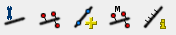
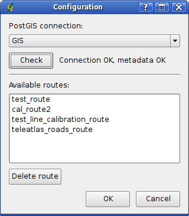
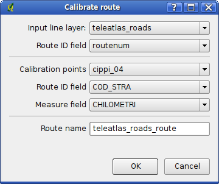
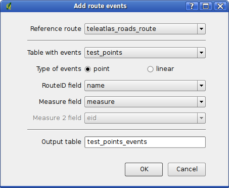
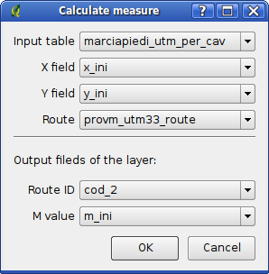

.. meta::
   :description: Faunalia linear referencing plugin
   :keywords: GIS, QGIS, GRASS, OTB, PostGIS, plugins, estensioni

Linear referencing plugin: Calculate dynamic segmentation for PostGIS layers
--------------------------------------------------------------------------------------------------

Installation of the plugin
..................................................................................................

The plugin can be downloaded from the QGIS official repository: http://plugins.qgis.org

Steps:

* Start QGIS, in menu "Plugins" -> "Fetch Python Plugins..."
* in tab "Repositories" use button "Add third party repository..."
* click "OK", installer will download metadata from all repositories
* in tab Plugins select "Linear referencing with PostGIS" and click "Install plugin"
* after successful installation, enable plugin in menu "Plugins" -> "Manage Plugins..."

If everything went fine, the plugin will be started and will create a new toolbar with a set of icons:

The actions are the following (from left to right):

* Configure plugin
* Calibrate route
* Add route events
* Calculate M from coordinates
* Route info tool
 
Import data to PostGIS
..................................................................................................

The plugin expects that all data for processing is available in PostGIS database. If not so, the user has to import the shapefiles to PostGIS. You can use either command line ''shp2pgsql'' utility or use the DB Manager tool in Quantum GIS.

This is an example how to merge e.g. TeleAtlas data from shapefiles 00...04 to a one SQL script::

  shp2pgsql -c -S -W ISO-8859-1 ita079_i20____00.shp teleatlas_roads >>  teleatlas_roads.sql
  shp2pgsql -a -S -W ISO-8859-1 ita079_i20____01.shp teleatlas_roads >> teleatlas_roads.sql
  shp2pgsql -a -S -W ISO-8859-1 ita079_i20____02.shp teleatlas_roads >> teleatlas_roads.sql
  shp2pgsql -a -S -W ISO-8859-1 ita079_i20____03.shp teleatlas_roads >> teleatlas_roads.sql
  shp2pgsql -a -S -W ISO-8859-1 ita079_i20____04.shp teleatlas_roads >> teleatlas_roads.sql

Let's import the data to an existing PostGIS-enabled database::

  psql -d <dbname> -h <host> -U <user> -W -f teleatlas_roads.sql

**Please note**: data of type LINESTRINGM are not imported by the QGIS SPIT plugin; they are by shp2pgsql, but but the resulting table is ignored when searching for the layers for calibration because it is already calibrated. Therefore, load a non-LINESTRINGM; if you have a LINESTRINGM shp:

* load the shp in QGIS
* use "save as shapefile" - this will save a new shapefile, without M coordinate
* now you can load it with either spit or shp2pgsql
 
Using the plugin
..................................................................................................

Terminology:

* routes = line features that contain additionaly M values, they're used as linear referencing system
* events = map features (points or lines), their position is defined by measure value in their associated route

Configure plugin
..................................................................................................

Open configuration dialog with appropriate action in plugin's toolbar.

First of all it's necessary to choose a database which will be used. It's also possible to check whether the connection works fine. The plugin also needs one metadata table (''lin_ref_routes'') which stores a list of available routes in database. If the table is not found, the user will be asked if he wishes to add it.

The list of available database connections shows connections defined in QGIS. If you wish to add, edit or delete them, use a dialog available here: menu "Layer" -> "Add PostGIS Layer..."

Later, you can also delete existing route layers in this dialog from the database.
 
Calibrate route
..................................................................................................

Before dynamic segmentation can be done, the user needs to create routes which will be used as a reference system.

To create a route you need:

* lines layer - will be used as a reference system for dynamic segmentation
* points layer - for calibration of the layer with lines

When clicked on appropriate action in toolbar, the calibration dialog will be shown:

Here you will select:

* lines layer and its field that will be used for route identification (e.g. road name)
* points layer with calibration points and two fields: route identifier and measure values
* name for output layer

Then click OK and the process of calibration will be started. When finished, a new route layer will be created.

Notes on calibration
..................................................................................................

* Route must have exactly the same identification for lines and calibration points: "SP159-II" is not matched with "SP159-2". Identification is not case-sensitive, so "sp43" is the same as "SP43"
* If the route consists of more lines and connecting them doesn't produce a simple line, the result of calibration will be likely incorrect. There are two variants of the problem:

  * there's one part of the route with incorrect ID field (e.g. NULL) which splits it
  * some lines of one route compose a circle which cause ambiguity
 
Route info
..................................................................................................

Now you can inspect calibration of the routes. Load a route layer to map canvas (using menu "Layer" -> "Add PostGIS Layer..."), click the "Route info" action in plugin's toolbar and select a route from the layer by clicking on it with the route info tool active. A bunch of signs will be shown indicating measure value at the vertices:

Add events
..................................................................................................

Once you have a route layer, you can do dynamic segmentation on it. Click "Add route events" action from plugin's toolbar to open this dialog:

Here you select which route will be used as a reference and a database table with events. In the table, there must be a field for route identification and field(s) specifying object's position by the measure value.

After clicking OK, a new resulting layer will be created which will contain all columns from the original table with added geometry column with the position of the event. This layer can be loaded to QGIS as any other layer from PostGIS database (menu "Layer" -> "Add PostGIS Layer...")

 
Calculate measure
..................................................................................................

In case you have features with captured coordinates, you might want to calculate measure value for them. To do it, click "Calculate measure" action from plugin's toolbar, you'll get this dialog:

There's a list of (aspatial) tables you could use. When you select the table, choose columns in the table which contain x,y coordinates, choose a route that will be used for aligning features and finally select other two fields that will be filled: name of the route and calculated measure.

If you're using linear features, you'll have to do the calculation twice - once for start position, then for the end position. It's necessary to have a primary key defined for the table and there must be columns in the table which will receive the output.

If the point is too far from any line of the route, it won't be aligned and the output columns for the features will be left untouched. The tolerancy is set to 1000 (could be changed or made configurable).
