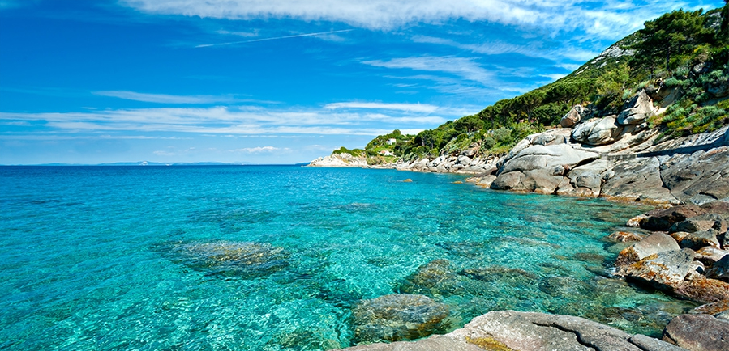

:tocdepth: 3

.. meta::
   :description: Faunalia training
   :keywords: GIS, QGIS, course, training, sailing

.. toctree::
    :hidden:

World first: sailing & QGIS
-----------------------------------

.. image:: images/qgis-icon.png
   :width: 100px
   :align: left

Love sailing? Need to learn GIS in depth? Come to the first course on free and open source GIS ever, focused on the popular `QGIS <http://qgis.org>`_ software, in one of the most scenic environments in Italy, the `Tuscany Archipelago <https://en.wikipedia.org/wiki/Tuscan_Archipelago>`_. You'll master the software, at the same time enjoying days of sailing, swimming, and sunbathing.

Every day you'll enjoy an alternance of GIS training and sailing around the islands. Every moment will be good to discuss practical applications of GIS. The small number of participants will guarantee maximum didactic efficiency.

During the evenings we'll have the opportunity for sharing knowledge and experience both about sea and GIS, and for socializing, on the boat and in local restaurants.

Course contents
++++++++++++++++++

The program will give a general and in depth overview of QGIS. Topics will include:

* how to start: installation, configuration, customization
* get the data: handling the many formats; raster, vectors, web services, catalogs
* dealing with projections: how to fit your data in
* working with GPS
* georeferencing and displaying images and photos
* analysing data: raster, vector, tables
* using the full power: GRASS, R, SAGA, OTB
* easily creating models and batch analyses
* remote sensing and land use analyses
* preparing beautiful maps
* mass production of maps.

Total duration of the training: at least 24 h of lessons + practical examples throughout the day.

* bring your laptop; all the necessary software will be installed during the course
* participants will get a certificate of attendance.

Language
+++++++++++

English, unless the whole crew will speak Italian or French

Dates
+++++++++++

23 to 29 July 2016

Fees
++++++++++++

For the full package, including the course and the renting of the boat and all related expenses, the total cost is **950 €**, plus VAT if applicable.

*Not included*: food and drinks, transportation to the harbour.

Trainer & skipper
+++++++++++++++++++

**Paolo Cavallini**, PhD, part of QGIS core team. He has the highest experience of QGIS teaching throughout the world (more than 200 courses and workshops). `See the details <intro.html#paolo-cavallini>`_.

Early subscription
+++++++++++++++++++

Being a world first, we require interested people to send us an **early** demonstration of interest.
Please send us an email (info@faunalia.eu) with:

* your name
* billing details (including VAT number if available)

Do not hesitate asking, if you need more info.

Please note:

* the subscription is confirmed upon payment of 100 €, refundable if the course is cancelled for any reason; payments to Faunalia (IBAN IT55 P052 3271 1310 0002 0048 369, SWIFT POSOIT22, BIC BLJAIT31)
* the course will be confirmed when the minimum number of subscribers will be reached.
