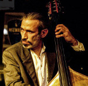

Chi siamo
------------------------------------------------------------

L'attività di Faunalia si basa su una fitta rete internazionale di collaboratori. Il *core team* è composto da:

.. |it| image:: images/italy.png
.. |pt| image:: images/portugal.png

Paolo Cavallini |it| |pt|
++++++++++++++++++++++++++++++++++++++++++++++++++++++++++++
.. rst-class:: thumbnail staff-img

.. image:: images/pc.jpg
   :width: 150 px
   :align: left

* Fondatore di Faunalia
* Membro del *QGIS Project Steering Commitee* col ruolo di *Financial/Marketing Advisor*
* Socio fondatore di ed ex presidente di `GFOSS.it - Italian Geographic Free and Open-Source Software Association <http://www.gfoss.it/drupal/>`_
* Socio e *charter member* della fondazione internazionale `OSGeo - Open Source Geospatial Foundation <http://www.osgeo.org/>`_
* Socio fondatore di `ITPUG - ITalian PostgreSQL User Group <http://www.itpug.org>`_
* Membro di `IUCN - The World Conservation Union - Species Survival Commission <http://www.iucn.org/>`_, ex Presidente dello *IUCN Small Carnivore Specialist Group* e membro dello *IUCN - European Sustainable Use Specialist Group*
* Oltre 10 anni di esperienza sui GIS liberi
* Dottore di ricerca

* :doc:`Curriculum Vitae (html) <cv_pc>`
* `Curriculum Vitae (pdf) <pdf/Cavallini_CV_it.pdf>`_
* `Curriculum Vitae europeo (pdf) <pdf/Cavallini_CV_eu.pdf>`_

* *e-mail*: cavallini@faunalia.it
* *PEC*: paolo.cavallini@pec.it
* *Tel/Viber/Line*: +39-348-3801953
* *Skype*: paolo.gg.cavallini
* *Hangout*: paolo.cavallini@gmail.com

.. raw:: html

	

Renzo Cavallini |it|
++++++++++++++++++++++++++++++++++++++++++++++++++++++++++++
.. rst-class:: thumbnail staff-img

* Geologo, specializzato in geofisica
* Ha collaborato a livello scientifico e didattico con l'Università di Pisa
* Ha pubblicato nel settore geofisico
* Conduce attività di prospezione geotecnica, in laboratorio ed *in situ*

  * esecuzione ed elaborazione di prove di laboratorio su terreni naturali: consolidazione edometrica, taglio diretto CD, triassiali (UU, CU, CD), compressione semplice, analisi granulometrica, limiti di consistenza (LL, LP, LR), peso specifico dei granuli, permeabilità in cella edometrica, triassiale e in permeametro (norme seguite: racc. AGI, CNR, ASTM)
  * esecuzione ed elaborazione di prove di laboratorio su materiali stradali e da costruzione: compattazione Proctor Standard e modificata, penetrazione CBR, miscelazione delle terre con calce (norme seguite: EN, CNR, ASTM)
  * esecuzione ed elaborazione di prove in situ: penetrometriche statiche con punta meccanica, elettrica e piezocono, penetrometriche dinamiche con o senza rivestimento, PLT, densità in situ
  * installazione e messa a punto di apparecchiature di laboratorio e di sistemi di acquisizione automatica; calibrazione di trasduttori elettrici

* *e-mail*: renzo.cavallini@faunalia.it

Giovanni Manghi |pt|
++++++++++++++++++++++++++++++++++++++++++++++++++++++++++++
.. rst-class:: thumbnail staff-img
.. image:: images/gm.jpg
   :width: 150 px
   :align: left

* Fondatore di Faunalia Portogallo
* Biologo specializzato in Conservation Biology
* Socio e *charter member* della fondazione internazionale `OSGeo - Open Source Geospatial Foundation <http://www.osgeo.org/>`_
* Socio fondatore di `OSGeo Portugal - Portuguese Geographic Free and Open-Source Software Association <http://osgeopt.pt/>`_
* Membro di `IUCN - The World Conservation Union - *IUCN Small Carnivore Specialist Group*
* Otre 7 anni di esperienza sui GIS liberi

* :doc:`Curriculum Vitae (html) <cv_gm>`
* `Curriculum Vitae (pdf) <pdf/Manghi_CV_it.pdf>`_
* `Curriculum Vitae europeo (pdf) <pdf/Manghi_CV_eu.pdf>`_

* *e-mail*: giovanni.manghi@faunalia.pt
* *Tel/Viber/Line*: +351967058216
* *Skype*: toirao
* *Hangout*: giovanni.manghi@gmail.com

Vânia Neves |pt|
++++++++++++++++++++++++++++++++++++++++++++++++++++++++++++
.. rst-class:: thumbnail staff-img
.. image:: images/vn.jpg
   :width: 150 px
   :align: left

* Fondatrice di Faunalia Portogallo
* Biologa specializzata in Conservation Biology
* Socia fondatrice di `OSGeo Portugal - Portuguese Geographic Free and Open-Source Software Association <http://osgeopt.pt/>`_
* Otre 7 anni di esperienza sui GIS liberi

* :doc:`Curriculum Vitae (html) <cv_vn>`
* `Curriculum Vitae (pdf) <pdf/Neves_CV_it.pdf>`_
* `Curriculum Vitae europeo (pdf) <pdf/Neves_CV_eu.pdf>`_

* *e-mail*: vania.neves@faunalia.pt
* *Tel/Viber/Line*: +351939320104
* *Skype*: vaniavanilla
* *Hangout*: vbneves@gmail.com
