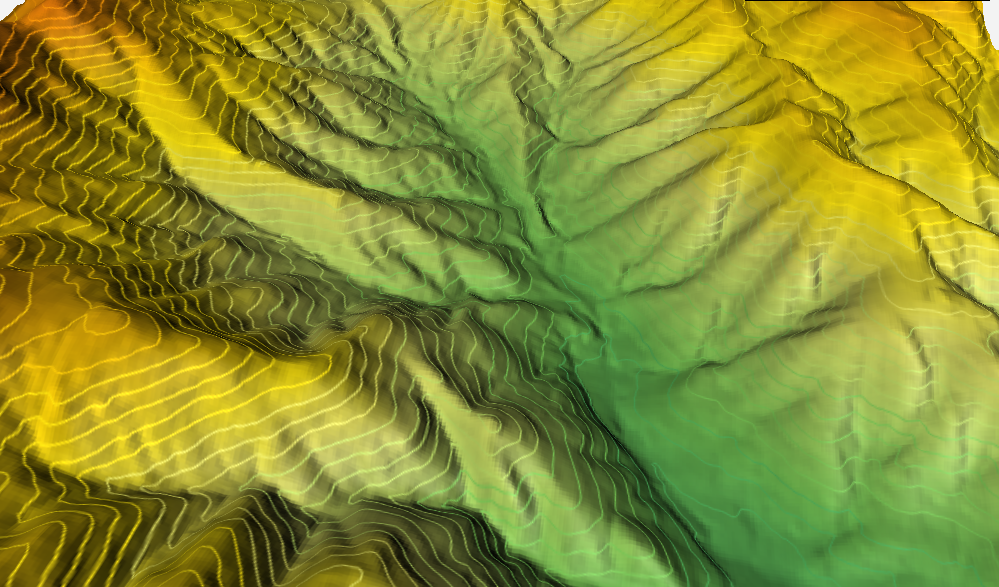
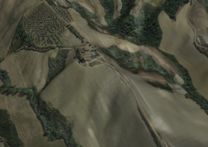
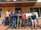
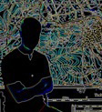
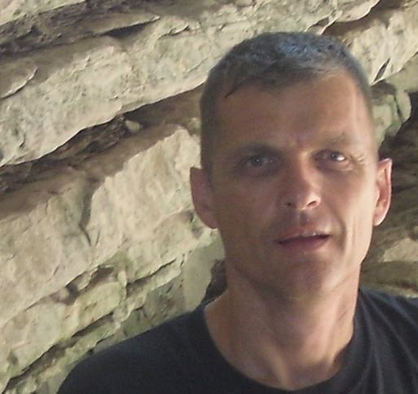
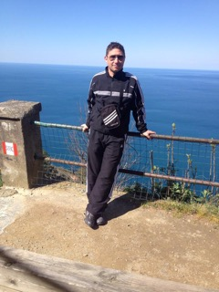
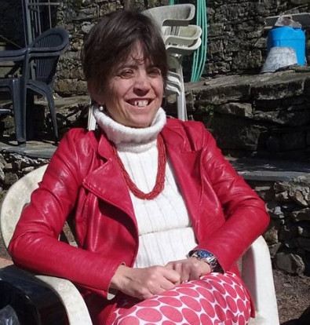

:tocdepth: 3

.. meta::
   :description: Training on Free and Open Source GIS: QGIS, PostGIS, GDAL, MapServer, GRASS
   :keywords: Open Source, Free Software, Software libero, GIS, SIG, QGIS, Quantum GIS, GRASS, SAGA, OTB, PostGIS, PostgreSQL, OsGeo, OGC, Webmapping, Webgis, Mapserver, QGIS Server, Lizmap, QGIS Web Client, corsi, corso, formazione, training courses, Database geografico, formation

.. |it| image:: images/italy.png
.. |pt| image:: images/portugal.png

.. toctree::
    :hidden:

    subscr_form_pt
    subscr_form_it
    subscr_form_en
    eval_form

Corsi
---------------------------------------------------

Faunalia ha l'esperienza più vasta nel mondo nella formazione sui GIS liberi, avendo realizzato oltre 300 fra corsi, seminari e workshops, in italiano, inglese, portoghese e francese, per oltre 4.500 persone.

Con QGIS puoi creare rappresentazioni 3D, navigabili anche sul web. Clicca sulle immagini per attivarle:

I corsi sono sempre aggiornati, utilizzando le ultime versioni disponibili di ciascun software.

Possiamo realizzare sia corsi standard che personalizzati, sia presso la nostra sede che nella vostra. I corsi di Faunalia sono presenti nel `catalogo del Mercato Elettronico della Pubblica Amministrazione <https://www.acquistinretepa.it/catricerche/manageViewRic.do?adfgenDispatchAction=searchMeta&metaprodotto=104567&strumento=mepa&textSearch=faunalia>`_ (**NB**: è necessario autenticarsi sul sistema). È quindi facilissimo per le Pubbliche Amministrazioni aderire, ed organizzarne in proprio.

Iscrivetevi alla `mailing list <http://lists.faunalia.it/cgi-bin/mailman/listinfo/corsi>`_ per ricevere gli annunci di nuovi corsi.

Perché scegliere i corsi di Faunalia?
+++++++++++++++++++++++++++++++++++++++++++++++++++

* Hanno un'alta qualità didattica: sono regolarmente valutati con indici di gradimento sempre molto alti (fra l'82% e il 93%, sulla base di questionari anonimi)
* Sono completamente interattivi: la teoria è quindi sempre abbinata alla pratica
* Sono tenuti da docenti che contribuiscono attivamente, da anni, allo sviluppo dei software oggetto dei corsi. In particolare, `Paolo Cavallini <cv_pc_it.html>`__ è *Co-chair* dell'Associazione internazionale **QGIS.org** e membro dello *Steering Committee* di QGIS, e Faunalia ha sviluppato parti significative di GRASS, PostGIS, GDAL ecc.
* Hanno un costo sensibilmente inferiore alle alternative proprietarie presenti sul mercato
* Contribuiscono al miglioramento dei software utilizzati, destinando al loro sviluppo parte delle quote di iscrizione
* Consentono l'accesso agli esami AICA per la `certificazione ECDL-GIS <http://www.aicanet.it/ecdl-gis/>`_. Paolo Cavallini è esaminatore ECDL-GIS.

Dicono di noi
=================

**Massimo Truscelli**, sysadmin, `MC-link S.p.A. <http://www.mclink.it/>`_: "Gran bel corso! Ho frequentato il corso di Faunalia tenuto da Paolo Cavallini su integrazione QGIS e PostgreSQL/PostGIS ed ho scoperto un mondo. Sono tornato a casa con un bagaglio di conoscenze maggiori e soprattutto un server da poter replicare su qualsiasi infrastruttura per costruire la propria base dati geografica consultabile a piacere. Ringrazio Paolo per la competenza, la pazienza e le ottime doti di docente. In particolare, per la sua capacità di non dare niente per scontato su argomenti e tecnologie dove altri considerano superfluo spiegare concetti basilari. Ringrazio gli altri partecipanti al corso per l’atmosfera di collaborazione instauratasi e per il bel “gruppo” che si è formato. Spero di ripetere l’esperienza con il successivo corso dedicato alla gestione dei dati geografici su Web.
Grazie ancora."

.. image:: images/gustavo.jpg
          :align: left

**Gustavo Presa Arias**, Geógrafo, `ENEL <https://www.enel.com/>`_: "Este curso de “QGIS funzionalità standard” ha cubierto mis expectativas, y lo valoro muy positivamente. Destaco la amabilidad y conocimientos del instructor del mismo (Paolo Cavallini). Yo le planteé muchas dudas y siempre estuvo dispuesto a aclararlas.
Esta formación ha estado enfocada como introducción general de QGIS versión 2.14.3, siendo recomendable tener conocimientos previos y experiencia en el manejo de un GIS desktop, ya que se tocaban temas específicos tales como definición de un Sistema de Coordenadas de Referencia (CRS), transformaciones “al vuelo”, uso de distintos código EPSG, simbología, etiquetado, concepto y uso de plugins, digitalización (creación de capas vectoriales, ayudas al dibujo –snapping-), consultas, temáticos, almacenamiento de datos(Spatialite/Geopackage, shp files…), importación de datos (shp, gdb, dxf, csv, xlsx… ), exportación de datos (pdf, kmz, tiff, jpg…), uso de servicios WMS, WFS, impresión de mapas, etc…
En resumen, mi valoración es muy, muy positiva."

**Juan Manuel Pérez Román**, GdD, `ENEL <https://www.enel.com/>`_: "El curso de “QGIS funzionalità standard” ha superado con creces mis expectativas. Se nos ha mostrado un producto adecuado a nuestras necesidades concretas y se nos ha resuelto de forma inmediata todas nuestras consultas. Destacar que el instructor Paolo Cavallini se ha mostrado abierto a resolver todas nuestras dudas particulares de una forma efectiva y concisa más allá de cualquier barrera idiomática. En resumen, un curso que valoro muy positivamente y personalmente lo considero totalmente recomendable."

------

.. image:: images/nina.jpg
          :align: left

`NINA <http://nina.no/>`_: "Paolo has been instructor 3 times for technicians and researchers in the **Norwegian Institute for Nature Research -NINA-**. He has made a QGIS new beginners course, a QGIS advanced course as well, as a Lizmap course specifically to fulfill the needs of the institute. He is a very experienced instructor, patient and willing to help the attendees. We are very much satisfied with the courses that make a quick off for starting to use this efficient tools. Thanks Paolo and Faunalia!"

------

**Howard Frederick** - *QGIS and PostGIS training* in Arusha for the `Tanzania Conservation Resource Centre <http://www.tzcrc.org/>`_: "We were fortunate to have Paolo Cavallini come and teach an advanced course in PostGIS with QGIS in Arusha in December 2015, the second time he has come to Tanzania to teach. Students were able to get into PostGIS very quickly, turning out some excellent analyses and getting the basics of setting up, administering and using a PostGIS database on their personal machines."

------

.. image:: images/picetti.jpg
          :align: left

**Cinzia Picetti, Monica Lazzari**, `ARPAL <http://www.arpal.gov.it/>`_: "Abbiamo fatto un primo corso presso Faunalia di Analisi con QGIS e siamo rimaste entusiaste della preparazione del docente e delle conoscenze apprese in 3 giorni.
Per il corso di WbMapping con QGIS abbiamo invece deciso di invitare Paolo Cavallini a tenere il corso presso ARPAL al fine di poter coinvolgere più colleghi nell'apprendimento.
Nonostante le difficoltà tecniche della nostra aula informatica, Paolo e' riuscito a illustrarci tutte le potenzialità di QGIS in ambito web e ci ha guidato nello sviluppo di alcuni esempi di servizi web sia con dati di esempio che con dati nostri. I colleghi che ancora non conoscevano bene QGIS o ne avevano una conoscenza di base sono rimasti entusiasti e ne hanno apprezzato anche la semplicità in un ambito di solito un po' ostico come il web.
Ancora un grazie a Paolo Cavallini per la sua disponibilità e competenza."

------

**Nobusuke Iwasaki**, `NARO <http://www.naro.affrc.go.jp/english/index.html>`_: "In Oct 2012, We held the Faunalia courses about QGIS in Japan. It was a great opportunity for Japanese user to learn and understand QGIS more deeply!"

------

.. image:: images/asahi.jpg
          :align: left

**Kosuke Asahi**, `FOSS4G Hokkaido <https://sites.google.com/site/foss4ghokkaido/>`_: "Dr.Paolo Cavallini's `QGIS workshop <https://sites.google.com/site/foss4ghokkaido/foss4g-hokkaido-2012/qgis-paolo>`_ in English is very easy to understand even for none-native English speaker like me. He kindly gave me a lot of practical skill from his workshop. I strongly recommend his workshop for non-native English speaker too."

------

.. image:: images/bonaposta.jpg
          :align: left

**Daniele Bonaposta**, cartografo: "Oltre il corso, le nozioni e le tecniche, si aprono le porte del mondo *open source*. Si ha la consapevolezza che un altro tipo di conoscenza è possibile, si entra a far parte di una comunità di tecnici ed esperti del settore. Si creano contatti, possibili occasioni di lavoro e anche amicizie. Ma questo nella descrizione del programma non c'è scritto!"

------

.. image:: images/tecnostudi.jpg
          :align: left

`Tecnostudi Ambiente <http://www.tecnostudiambiente.it/>`_: "Seguire un corso di QGis, anche di base, con Paolo Cavallini va oltre la semplice didattica. Approcciare o approfondire le conoscenze con chi il software lo sviluppa fornisce una marcia in più. Senza contare poi che la disponibilità, professionalità e simpatia di Paolo, che prosegue anche a corso ultimato, rende il tutto molto piacevole."

------

.. image:: images/paoloant.jpg
          :align: left

**Paolo Antonelli**, geologo: "In Faunalia ho frequentato con piacere tre corsi specifici: QGIS Advanced, GeoDB (PostgreSQL/PostGIS) e WebMapping. Tutti e tre i corsi sono stati gestiti da Paolo, che si dimostra una persona altamente competente, conoscitore approfondito dei GIS Open Source. La struttura dei corsi ed il materiale fornito mi hanno permesso, insieme al know-how di Paolo, di ampliare notevolmente la mia conoscenza e capacità lavorativa nell'utilizzo dei GIS. Consiglio fortemente Faunalia per l'approccio, le metodologie utilizzate e la disponibilità mostrata."

------

`Luca Puglisi <https://www.researchgate.net/profile/Luca_Puglisi>`_: "Ho seguito con grande profitto due corsi organizzati da Faunalia. L'attenzione con cui vengono ascoltate anche le esigenze dei corsisti rende questa esperienza formativa particolarmente efficace, rendendo le lezioni, rigorose da un punta di vista tecnico ma svolte in un clima informale, particolarmente piacevoli."

------

**Andrea Gagna**, `ProfessioneGeografo <https://www.facebook.com/R.I.ProfessioneGeografo/?view_public_for=569283503097366>`_:" Ho frequentato presso l'Azienda Faunalia SRL di Paolo Cavallini il mio primo Corso GIS Open Source avanzato e ormai si parla del 2012. Era focalizzato sull'analisi e il Geo-processing con QGIS integrato al GRASS tramite ononimo Plugin. Ricordo bene i tre fantastici giorni formativi trascorsi presso la sede della Faunalia perchè ebbi modo anzitutto di conoscere Paolo e la sua Azienda e iniziare a scoprire il "Mondo GIS Open Source" e le sue potenzialità, poi per l'eccellente ospitalità e disponibilità dimostrata durante l'erogazione delle lezioni ma soprattutto per il loro notevole tasso tecnico. Un Corso avanzato che però riprendeva concetti base e che permetteva quasi a chiunque di apprendere un'ottima  dimestichezza con il QGIS in quei soli 3 giorni di lezioni. Pensate che Io prima di fare il Corso avevo solo fatto un 4/5 ore di introduzione presso un Libero Professionista e che grazie alle competenze acquisite dal Corso della Faunalia ho potuto tranquillamente sostenere e ottenere l'ECDL GIS. Da quell'Ottobre 2012 ad oggi le mie competenze sono chiaramente incrementate e della tecnologia GIS ne sto facendo un lavoro nel senso che sto cercando di mettermi in proprio. Anche se in Italia siamo ancora un po' indietro, io credo fermamente nelle potenzialità della tecnologia GIS Open Source e nella necessità sempre più forte di figure professionali specializzate.
Quindi non posso che evidenziare la mia estrema soddisfazione per il Corso avanzato in Analisi vettoriale/raster con QGIS e plugin GRASS che feci nel 2012 presso Faunalia. Oltretutto ritengo che il rapporto qualità/prezzo sia tra i migliori sul mercato."

------

**Anonymous**: "il corso e' stato organizzato in modo preciso e  con chiare spiegazioni. Un altro grande vantaggio e' la ridotta partecipazione. Imparare qualcosa di nuovo in un gruppo piccolo significa avere più support da parte del trainer e a creare un network con gli altri partecipanti del corso"

------

**Niccolò Frassinelli**: "Nonostante l'uscita di una nuova versione di QGis appena due giorni prima del corso base, Paolo si è dimostrato preparatissimo, visto anche il suo impegno nello sviluppo del software. Oltre alla preparazione, ha avuto capacità didattiche molto buone. Il confronto con le necessità di noi corsisti è stato costante e la disponibilità ad aiuti dopo il corso totale. Non posso che consigliare a tutti i corsi di Faunalia, come del resto già ho fatto e faccio."

------

.. image:: images/barbieri.jpg
          :align: left

**Marco Barbieri**, `webmapp.it <http://webmapp.it>`_: "Ero da tempo alla ricerca di un corso su PostGIS, avendo difficoltà ad usare questo strumento fondamentale per il mio lavoro. Ho trovato e seguito il corso tenuto da Paolo: completo, chiaro e ben documentato. Grazie al corso ora sono autonomo nella creazione e gestione di database spaziali e sopratutto sono in grado di leggere la documentazione online e di capire quello che viene scritto nei forum! Quindi progredire nella conoscenza ed utilizzo del vasto e ricco mondo di PostGIS.
Grazie ancora davvero per il tuo corso, Paolo."

------

**Emiliano Stefanini**: "i corsi di Faunalia: un must per chi vuole lavorare con Qgis!!!"

.. raw:: html

    

------

**Emanuele Tataranni**: "I corsi di Faunalia sono i migliori nel campo dei sistemi informativi geografici. Ho potuto apprendere molto sui GIS open source (mondo a me prima poco conosciuto) e metterlo in pratica in contesto lavorativo grazie alla semplicità di insegnamento e alla chiarezza nell'esposizione di Paolo. Consiglio a tutti di affidarsi ai corsi di Faunalia. ... e poi la cecina di Pontedera è buonissima!"

------

**Salvatore "Totò" Fiandaca**, `PigrecoInfinito <https://pigrecoinfinito.wordpress.com/>`_: "Nel marzo del 2014 seguii il corso base di cartografia con QGIS  tenuto da Paolo Cavallini: corso ben strutturato, ricco di esempi pratici, teoria e soprattutto si respirava aria di OPEN SOURCE. Imparai molte cose ma soprattutto il modo di collaborare per migliorare QGIS tramite la ML Gfoss, segnalazioni di bug tramite la bugtracker; il tutto in un ambiente accogliente e professionale."

------

**Lorenzo Luisi**, `Spazio Cartografico Pugliese <http://spaziocartograficopugliese.it/>`_: "Ho sempre immaginato QGIS come un Davide che sorprende i Gis closed source. I corsi di Faunalia pongono le basi perché questo si avveri!"

------

**Umberto Zulian**, `Provincia di Belluno <http://serviziinformativi.provincia.belluno.it/>`_, `WebGIS Belluno <http://webgis.provincia.belluno.it/>`_: "Mi sono trovato benissimo a frequentare i corsi Faunalia (geodatabase, analisi e webmapping) che sono serviti per mettere in produzione ed approfondire le conoscenze lavorative che avevo già: il docente Paolo è mitico (lo definisco il “guru” di QGIS), il materiale fornito permette di portare a casa progetti di lavoro già funzionanti che non si basano solo sulla teoria ma su dati geografici attuali ed analisi territoriali operative."

------

**Lorenzo Fusco**: "Paolo Cavallini? Fantastico! Il corso poi, per la quantità di porte che apre lo si potrebbe fare con colonna sonora di doors". Più formale: "Consiglio a tutti la professionalità di Paolo Cavallini, glielo si legge negli occhi che è un vero appassionato, oltre che competente gissaro. Il corso è strutturato benissimo e lui è una persona molto disponibile, anche successivamente, quando, a casa, quel passaggio su cui hai preso male gli appunti proprio non ti riesce. In due giorni mi ha messo in grado di realizzare delle fantastiche mappe web oltre che avermi aperto le porte dell'amplissimo mondo del webgis"

------

**Enrico Bertonati**, `Vigili del Fuoco <http://www.vigilfuoco.it/>`_: "Ho fatto tutti i  corsi alla fine dello scorso anno e mi sono ritrovato all’ingresso di un mondo fantastico, quello del Gis e non solo, dove sicuramente il Dott. Cavallini ne è un’ottima guida.
Spero in futuro di continuare ad approfondire queste materie ed ottenere sempre più migliori risultati."

------

.. image:: images/mastrolonardo.jpg
          :align: left

**Silvano Mastrolonardo**: "Ho apprezzato molto il corso, e Paolo mi ha aperto un mondo tutto nuovo prima completamente sconosciuto. Ora vedo il Gis e i DataBase sotto un punto di vista diverso, oltre ad aver appreso la logica che li attraversa."

------

**Marta Puppo**: "Utile. Intenso. Molto efficace! Ho seguito il corso perché avevo bisogno di realizzare un WebGis in tempi molto stretti. Paolo ci ha guidato nella realizzazione dell'applicazione fornendoci un server virtuale funzionante prezioso per replicare l'installazione su altre macchine. Prezioso anche il legame che si è creato tra i corsisti. Grazie di tutto!"

------

**Vuoi lasciare anche tu il tuo commento?** `Scrivici`_  - Grazie!

.. _Scrivici: info@faunalia.it?subject=Testimonials

Calendario
+++++++++++++++++++++++++++++++++++++++++++++++++++

.. rst-class:: table

======================================== ==================== ==============  =================== ========
Corso                                    Date e durata        Dove            Scadenza iscrizione Lingua
======================================== ==================== ==============  =================== ========
WebMapping con QGIS (IT)                 07-09 Febbraio 2018  Pontedera, IT   22 Gennaio 2018     Italiano
Cartografia con QGIS (IT)                13-15 Febbraio 2018  Pontedera, IT   29 Gennaio 2018     Italiano
Corso di aggiornamento a QGIS 3 (IT)     16 Febbraio 2018     Pontedera, IT   02 Febbraio 2018    Italiano
Analisi con QGIS (IT)                    Aprile 2018          Pontedera, IT                       Italiano
Geodatabase: PostgreSQL e PostGIS (IT)   da definire          Pontedera, IT                       Italiano
Python e QGIS: pyqgis e plugin           da definire          Pontedera, IT                       Italiano
======================================== ==================== ==============  =================== ========

Le date sono soggette a cambiamento per esigenze logistiche.

Costi
+++++++++++++++++++++++++++++++++++++++++++++++++++

* Tutti i corsi standard (3 giorni), eccetto Python-QGIS e Aggiornamento a QGIS 3: 350 € per i privati, 330 € + IVA per aziende/partite IVA (meno ritenuta d'acconto, da versare 336,82 €), 360 € IVA esclusa per enti pubblici (meno ritenuta d'acconto, da versare 288,24 €). Corso Python-QGIS solo a richiesta. Corso di Aggiornamento a QGIS 3: 120€ per i privati, 120 € + IVA per aziende/partite IVA (meno ritenuta d'acconto, da versare 122,48 €), 130 € IVA esclusa per gli enti pubblici (meno ritenuta d'acconto, da versare 104,09 €).
* **Sconti**: 5% per l'iscrizione simultanea a più corsi
* **Certificazione QGIS.ORG**: Faunalia è **l'unica azienda italiana** a poter rilasciare una `certificazione ufficiale riconosciuta dalla fondazione internazionale di QGIS <http://changelog.qgis.org/en/qgis/certifyingorganisation/qgis-faunalia/>`_. Puoi richiedere questa certificazione ad un costo aggiuntivo di 50 €. Questi fondi sono destinati allo sviluppo di QGIS.

Iscrizione
+++++++++++++++++++++++++++++++++++++++++++++++++++

Ti preghiamo di iscriverti appena ti è possibile, in modo da consentirci di organizzare al meglio la logistica.

* **Iscrizione**: confermata al versamento di una caparra di 100 €, saldo prima dell'inizio del corso; è possibile versare l'intera quota in unica soluzione; in caso il corso non si svolga per qualunque motivo, la quota versata verrà interamente restituita
* **Conferma**: il corso sarà confermato al raggiungimento del numero minimo di partecipanti
* **Requisiti**: computer portatile in buono stato di funzionamento; i programmi necessari verranno installati durante il corso
* **Attestato**: la partecipazione al corso dà diritto ad un attestato di partecipazione
* **Pagamenti**: bonifico sul conto corrente di Faunalia (IBAN IT55 P052 3271 1310 0002 0048 369), indicando nella causale nome e cognome dell'iscritto e nome del corso; si raccomanda di inviare tutti i dati necessari per la fatturazione tramite il modulo qui di seguito

.. cssclass :: wht

`Iscriviti qui <subscr_form_it.html>`_

Logistica
+++++++++++++++++++++++++++++++++++++++++++++++++++

**Sede**: Pontedera (PI), presso `Pont-Tech <http://www.pont-tech.it/contatti/>`_, oppure `Faunalia <http://www.openstreetmap.org/#map=19/43.66184/10.63806>`_, facilmente raggiungibili con mezzi pubblici (treno ed aereo). `Dettagli sulla città <http://www.comune.pontedera.pi.it/cittadino/Citta_index/ufficio-turistico/ufficio_turistico>`_ (incluse strutture ricettive). Convenzione con `Il Piccolo <http://www.ilpiccolorooms.it/>`_, per il pernottamento: 45/60/80 € per camere singole/doppie/triple.

Programmi
+++++++++++++++++++++++++++++++++++++++++++++++++++

Cartografia con QGIS
===================================================

Per imparare ad installare ed utilizzare QGIS, ad accedere ai dati, tematizzarli in modo sofisticato e produrre mappe di alta qualità grafica ed informativa, ad elevato contenuto informativo e ad alta qualità grafica. Vedi `alcuni esempi <https://www.flickr.com/groups/qgis/>`_ di cosa sarà possibile realizzare. Con QGIS puoi produrre anche animazioni:

.. figure:: images/animation.gif
   :alt: Con QGIS puoi produrre anche animazioni!

   Movimenti di renne in Norvegia.

Adatto a tutti, sia esperti del GIS che principianti. È necessario avere dimestichezza con l'uso del PC.

Argomenti principali
...................................................................................................

* Breve introduzione a QGIS e ai Sistemi Informativi Geografici *open source*
* Installazione di QGIS nei vari sistemi operativi
* Interfaccia utente e criteri di utilizzo
* Configurazione dell'ambiente di lavoro
* Gestione delle proiezioni
* Progetti
* Gestione dei plugins
* I dati geografici vettoriali

  * proprietà, importazione ed esportazione, conversione fra formati
  * tematizzazione vettoriale ed etichettatura avanzata
  * tabelle dati, attributi ed azioni; importazione di dati tabellari

* Interfacciamento con GPS
* Digitalizzazione dei vettori, vettorializzazione avanzata di tipo "CAD"
* I geodatabase e QGIS: PostGIS e SpatiaLite
* Caricare dati dal web: soluzioni proprietarie, libere e standard (Google Maps, OpenLayers, WMS, WFS, WFS-T, CSW, WPS)
* Gestione di fotografie georeferenziate
* Esportazione dati per Google Earth
* I dati geografici raster

  * caratteristiche e proprietà, tematizzazione
  * gestione dei sistemi di riferimento, mosaici
  * georeferenziazione

* Creazione di animazioni
* Visualizzazione 3D
* Stampa avanzata, stampa seriale

Durata
...................................................................................................
Tre giorni *full time*

Analisi con QGIS
===================================================

Per imparare a realizzare analisi raster e vettoriali, e modellistica spaziale, unendo la potenza di elaborazione GIS di `GRASS <https://grass.osgeo.org/>`_, `SAGA <http://www.saga-gis.org/>`_, `Orfeo ToolBox <https://www.orfeo-toolbox.org/>`_, ecc., con la semplicità d'uso di QGIS. Al termine del corso, l'utente avrà appreso a gestire con facilità l'ambiente di lavoro di QGIS, e ad effettuare analisi anche molto complesse in modo semplice ed intuitivo.

Adatto a chi desidera approfondire l'uso analitico e predittivo dei GIS, avendo già delle nozioni di base.

È necessaria una conoscenza base del GIS. È altamente consigliabile una conoscenza di base di QGIS.

Argomenti principali
...................................................................................................

* Le alternative disponibili entro QGIS: quale la più adatta per ogni scopo
* Analisi vettoriali di base

  * dissolve, merge, overlay, buffer, gestione delle tabelle di attributi, ecc.

* Correzione di errori topologici e semplificazione dei vettori
* Analisi raster

  * analisi geomorfologica: creazione di modelli digitali del terreno, curve di livello, mappe di pendenza, esposizione, ombreggiatura
  * interpolazioni
  * analisi di distanza
  * riclassificazione dei raster, algebra delle mappe
  * statistiche zonali
  * esempi: analisi di intervisibilità, idrologiche, multi criterio: mappe di priorità, mappe di rischio

* Analisi d'immagine

  * classificazione automatica dell'uso del suolo
  * estrazione di elementi

* Gestione delle proiezioni
* Calcolatore raster e vettoriale
* Creazione di modelli tramite interfaccia grafica
* Automazione di analisi ricorsive ed in serie tramite interfaccia grafica
* Script per l'automazione di processo

Durata
...................................................................................................

Tre giorni *full time*

Geodatabase: PostgreSQL e PostGIS
===================================================

Per apprendere a creare e gestire banche dati geografiche complesse, e realizzare analisi approfondite con visualizzazione in tempo reale delle analisi fatte. Il corso permette di familiarizzare con la gestione dei dati vettoriali tramite SQL, con l'importazione dei dati geografici e l'interrogazione di dati sia geografici che alfanumerici tramite numerose applicazioni.

Al termine del corso, i discenti avranno a loro disposizione una **server PostGIS virtualizzato**, completamente **funzionante ed efficiente**, pronto per essere utilizzato in un qualsiasi provider.

Preferibile, ma non indispensabile, una conoscenza anche rudimentale del linguaggio SQL. È necessario avere piena dimestichezza con l'uso del PC.

Argomenti principali
...................................................................................................

* Breve introduzione ai Sistemi Informativi Territoriali *open source*
* Vantaggi dell'uso di un database nel GIS
* Introduzione a `PostgreSQL <https://www.postgresql.org/>`_
* Prima configurazione del database: i files di configurazione, gestione del server
* Ottimizzazione di PostgreSQL
* Introduzione a `PostGIS <http://postgis.net/>`_ (standard `Open Geospatial Consortium <http://www.opengeospatial.org/>`_)
* Geodatabase: struttura e formato dati
* Amministrazione da riga di comando: psql
* Amministrazione da interfaccia grafica: QGIS, PhpPgAdmin, PgAdmin 3, OpenOffice, ecc.
* Amministrazione del database e accesso ai dati: ruoli, utenti, gruppi, permessi, accessi
* Schemi, tabelle, viste, funzioni
* Creazione di un database geografico
* PostGIS e QGIS

  * importazione ed esportazione shapefile ed altri formati
  * digitalizzazione
  * query, *plugins* avanzati, storicizzazione, ecc.

* Analisi spaziali in SQL: esercizi pratici, di base ed avanzati
* Indici spaziali
* Benchmarking
* Funzioni avanzate di geodatabase
* Sistemi di riferimento spaziale, conversione tra sistemi di coordinate
* I raster in PostGIS
* Cenni sulla topologia
* Copia e salvataggio

Durata
...................................................................................................
Tre giorni *full time*

WebMapping con QGIS
===================================================

Per apprendere in breve tempo il più innovativo e semplice ambiente di sviluppo per WebGIS e WebMapping, basato su QGIS.

Consente di pubblicare sul web le mappe sviluppate e configurate tramite QGIS Desktop, senza necessità di complesse operazioni di configurazione del loro aspetto grafico.

Al termine del corso, i discenti avranno a loro disposizione una **server WebGIS virtualizzato**, completamente **funzionante ed efficiente**, pronto per essere utilizzato in un qualsiasi provider.

Sono necessarie nozioni di base sui GIS, sulla cartografia e sul web. È consigliabile una conoscenza di base di QGIS. È necessario avere piena dimestichezza con l'uso del PC.

Argomenti principali
...................................................................................................

* Come scegliere il WebGIS che fa per te
* La pubblicazione semplicissima: generazioni di semplici applicazioni `Leaflet <http://leafletjs.com/>`_ e `OpenLayers <http://openlayers.org/>`_ a partire da progetti QGIS, con pochi click
* Creazione di semplici applicazioni web 3D navigabili
* Gli standard *Open Geospatial Consortium* per la pubblicazione WebGIS

  * WMS, WFS, WFS-T, WCS, WPS

* Crea il tuo server
* Ottimizzazione del server
* Sicurezza del server
* Installazione e configurazione di QGIS server
* Pubblicare servizi WMS e WFS
* WebGIS ricchi di funzioni: `QGIS web client <https://github.com/qgis/QGIS-Web-Client/>`_ (`demo <https://gis.uster.ch/>`_) e `LizMap <https://www.3liz.com/lizmap.html>`_
* Approfondimento su `LizMap <https://www.3liz.com/lizmap.html>`_

  * funzionalità di base
  * guida per l'utente
  * guida per l'amministratore: installazione e configurazione
  * gestione di utenti e gruppi
  * guida per chi pubblica le mappe: visualizzazione dei dati, foto, files
  * come rendere veloce il tuo WebGIS: criteri di ottimizzazione
  * editing online: WFS-T

Durata
...................................................................................................

Tre giorni *full time*

Python e QGIS: pyqgis e plugin
===================================================

Per capire come potenziare QGIS con il linguaggio di programmazione Python. La finalità principale è quella di fornire gli strumenti e i concetti base per sviluppare script in Python e creare plugins. Dopo una breve introduzione a Python, i partecipanti saranno guidati passo a passo nella creazione di script e di un plugin.

È preferibile, ma non obbligatoria, una conoscenza di base di Phyton. È necessaria una conoscenza di base dei principi di programmazione.

Argomenti principali
...................................................................................................

* Come creare plugin Python per QGIS

  * la sintassi Python
  * il mio primo plugin in Python: mostra un messaggio in un riquadro
  * creare interfacce utente con QtDesigner (.ui)
  * secondo plugin: aggiungere un layer all’area di mappa di QGIS

* Le classi principali delle API Qt

  * il modulo QtCore (QObject, QString, QAction, QFile, ...)
  * il modulo QtGui (QWidget, QDialog, QMessageBox, QFileDialog, ...)
  * accedere alla API QT tramite Python: PyQt (tipi Qt mappati da tipi nativi Python, parametro di uscita)

* Le principali classi API QGIS e le loro relazioni

  * costanti e impostazioni: classi QGis e QgsApplication
  * l’interfaccia del plugin: QgisInterface e metodi comuni usati nei plugins
  * area mappa, strati e legenda: QgsMapCanvas, QgsMapLayer, QgsLegendInterface, QgsMapLayerRegistry
  * strati vettoriali: QgsVectorLayer, QgsVectorDataProvider, QgsField, QgsFeature, QgsGeometry
  * strati raster: QgsRasterLayer, QgsRasterDataProvider
  * strumenti di mappa e banda elastica: QgsMapTool, QgsMapToolEmitPoint, QgsRubberBand
  * elementi della mappa e snap: QgsMapCanvasItem, QgsVertexMarker, QgsSnapper
  * classi dei sistemi di riferimento: QgsCoordinateReferenceSystem, QgsCoordinateTransform

* Usiamo pyQGIS

  * esempi di codice

Durata
...................................................................................................

Tre giorni *full time*

Aggiornamento a QGIS 3
==================================
Per imparare a utilizzare tutti i nuovi strumenti della prossima versione di QGIS 3.
Il corso è rivolto a tutte le persone che intendono imparare le novità della nuova versione di QGIS.

È obbligatoria una buona conoscenza di QGIS in quanto non verranno trattati nuovi argomenti, ma verranno mostrate le nuove funzionalità di QGIS 3.

Argomenti principali
............................

* nuove modalità di aggiunta dei dati
* nuova interfaccia delle proprietà di vettore e raster
* nuova interfaccia di digitalizzazione
* cad tools e creazione figure geometriche
* 3D
* nuovo compositore di stampe
* task manager e processi in background
* impressionante miglioramento di Processing
* multi mappe
* novità di interrogazione layer
* integrazione con GeoNode
* nuovo sistema di etichettatura e storage di informazioni temporanee

Durata
.............

Un giorno *full time*
